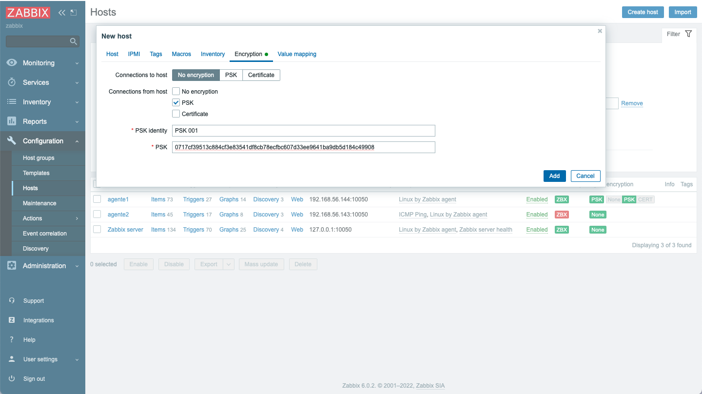

# Curso de Zabbix
## Instalar en Ubuntu 20.04 Focal, Zabbix Agente

Comprobar que la instalación este actualizada

```
$ sudo su
# apt update
# apt upgrade
```

Instalar herramientas necesarias configuracion

```
# apt install neovim
```
Instalar Repositorio de Zabbix

```
# wget https://repo.zabbix.com/zabbix/6.0/ubuntu/pool/main/z/zabbix-release/zabbix-release_6.0-1+ubuntu20.04_all.deb
# dpkg -i zabbix-release_6.0-1+ubuntu20.04_all.deb
# apt update
```

Instalar Zabbix Agente

```
# apt install zabbix-agent

```
### Configuración Manual ### 

Para conectar nuestro agente existe la posibilidad, de hacerlo sin encriptación, con certificados, o con claves precompartidas (PSK), para proteger la conexion entre servidor y agente, generar una PSK:

```
# sh -c "openssl rand -hex 32 > /etc/zabbix/zabbix_agentd.psk"
# cat /etc/zabbix/zabbix_agentd.psk
0717cf39513c884cf3e83541df8cb78ecfbc607d33ee9641ba9db5d184c49908
```

Editar el archivo de configuracion: /etc/zabbix/zabbix_agentd.conf

```
PidFile=/run/zabbix/zabbix_agentd.pid
LogFile=/var/log/zabbix/zabbix_agentd.log
LogFileSize=3
Server=192.168.56.145,127.0.0.1 # 192.168.56.145 Zabbix Server Curso
ServerActive=192.168.56.145
Hostname=agente1
Include=/etc/zabbix/zabbix_agentd.d/*.conf
TLSConnect=psk
TLSAccept=psk
TLSPSKIdentity=PSK 001
TLSPSKFile=/etc/zabbix/zabbix_agentd.psk
```

Reiniciar los servicios, comprobar sus estados y habilitarlos

```
# systemctl restart zabbix-agent 
# systemctl status zabbix-agent
● zabbix-agent.service - Zabbix Agent
     Loaded: loaded (/lib/systemd/system/zabbix-agent.service; disabled; vendor preset: enabled)
     Active: active (running) since Tue 2022-04-05 14:43:02 UTC; 16min ago
   Main PID: 646 (zabbix_agentd)
      Tasks: 6 (limit: 1066)
     Memory: 11.2M
     CGroup: /system.slice/zabbix-agent.service
             ├─646 /usr/sbin/zabbix_agentd -c /etc/zabbix/zabbix_agentd.conf
             ├─651 /usr/sbin/zabbix_agentd: collector [idle 1 sec]
             ├─652 /usr/sbin/zabbix_agentd: listener #1 [waiting for connection]
             ├─653 /usr/sbin/zabbix_agentd: listener #2 [waiting for connection]
             ├─654 /usr/sbin/zabbix_agentd: listener #3 [waiting for connection]
             └─655 /usr/sbin/zabbix_agentd: active checks #1 [idle 1 sec]

Apr 05 14:43:02 manual systemd[1]: Starting Zabbix Agent...
Apr 05 14:43:02 manual systemd[1]: Started Zabbix Agent.

systemctl enable zabbix-agent
```


Ir a la opcion de <span style="color:#2471A3">Configuration/Hosts/Create host</span> 

Configurar:

 <span style="color:#2471A3">Host name</span>

<span style="color:#2471A3">Groups</span>

<span style="color:#2471A3">Interfaces</span>
agregar del tipo <span style="color:#138D75">Agent</span> con la <span style="color:#2471A3">IP address</span> y <span style="color:#2471A3">Port</span> correspondientes



Ir a la pestaña <span style="color:#2471A3">Encryption</span> seleccionar <span style="color:#138D75">PSK</span>, y agregar el valor de <span style="color:#2471A3">PSK Identity</span> y <span style="color:#2471A3">PSK</span>


Ir a la opcion de <span style="color:#2471A3">Monitoring/Hosts</span> y verficar que el host agregado (192.168.56.144) tenga la disponibilidad en verde y no es asi y esta en rojo, verifique los datos y/o eventuales Firewall


### Configuración Automatica ###


Para facilitar la gestion de agentes es posible generar una autoregistracion a partir que el agente cuando inicia envia informacion al server, basicamente el nombre la ip y eventualmente la variable **HostMetaData**, si esta configurada.

La variable **HostMetaData** contiene un string de 0-255 caracteres en formato **UTF-8**. Por lo tanto puede contener cualquier cosa, es conveniente utilizar una palabra con un hash de tipo **MD5**

Para obtner el hash correspondiente nos conectamos al Server de Zabbix y ejecutamos:

```
$ sudo su
# echo curso2022| md5sum
e1722ba6534ccfe0461fd25e261d5613
```


Ir a la opcion de <span style="color:#2471A3">Configuration/Actions/Autoregistration actions/Create action</span> 

Configurar:

 <span style="color:#2471A3">Name</span>

<span style="color:#2471A3">Conditions/Add</span>


Seleccionar el tipo <span style="color:#138D75">Host metadata</span>

Y el <span style="color:#2471A3">Operator</span> selecionar <span style="color:#138D75">contains</span>
 <span style="color:#2471A3">Value</span> agregar el **hash md5** creado


Ir a la pestaña <span style="color:#2471A3">Operations</span> y agregar las operaciones deseadas, en nuestro caso:

<span style="color:#138D75">Add host</span>

<span style="color:#138D75">Add to host groups: Linux servers</span>

<span style="color:#138D75">Link to templates: ICMP Ping, Linux by Zabbix agent</span>


<span style="color:#138D75">Set host inventory mode: Automatic</span>


Una vez concluida la configuracion de la accion debe quedar con el  <span style="color:#2471A3">Status</span> **Enabled**

A continucación debemos ejecutar el siguiente comando en Server de Zabbix:

```
# zabbix_server -R config_cache_reload
```


Editar el archivo de configuracion: /etc/zabbix/zabbix_agentd.conf

```
PidFile=/run/zabbix/zabbix_agentd.pid
LogFile=/var/log/zabbix/zabbix_agentd.log
LogFileSize=3
Server=192.168.56.145,127.0.0.1 # 192.168.56.145 Zabbix Server Curso
ServerActive=192.168.56.145
Hostname=agente2
HostMetaData=e1722ba6534ccfe0461fd25e261d5613
Include=/etc/zabbix/zabbix_agentd.d/*.conf
```

Reiniciar los servicios, comprobar sus estados y habilitarlos

```
# systemctl restart zabbix-agent 
# systemctl status zabbix-agent
● zabbix-agent.service - Zabbix Agent
     Loaded: loaded (/lib/systemd/system/zabbix-agent.service; disabled; vendor preset: enabled)
     Active: active (running) since Tue 2022-04-05 14:43:02 UTC; 16min ago
   Main PID: 646 (zabbix_agentd)
      Tasks: 6 (limit: 1066)
     Memory: 11.2M
     CGroup: /system.slice/zabbix-agent.service
             ├─646 /usr/sbin/zabbix_agentd -c /etc/zabbix/zabbix_agentd.conf
             ├─651 /usr/sbin/zabbix_agentd: collector [idle 1 sec]
             ├─652 /usr/sbin/zabbix_agentd: listener #1 [waiting for connection]
             ├─653 /usr/sbin/zabbix_agentd: listener #2 [waiting for connection]
             ├─654 /usr/sbin/zabbix_agentd: listener #3 [waiting for connection]
             └─655 /usr/sbin/zabbix_agentd: active checks #1 [idle 1 sec]

Apr 05 14:43:02 manual systemd[1]: Starting Zabbix Agent...
Apr 05 14:43:02 manual systemd[1]: Started Zabbix Agent.

systemctl enable zabbix-agent
```


Ir a la opcion de <span style="color:#2471A3">Monitoring/Hosts</span> y verficar que el host agregado (192.168.56.143) tenga la disponibilidad en verde y no es asi y esta en rojo, verifique los datos y/o eventuales Firewall


Ir a la opcion de <span style="color:#2471A3">Inventory/Hosts</span> y constatar que el hosts este presente en el inventario y verificar su detalle


