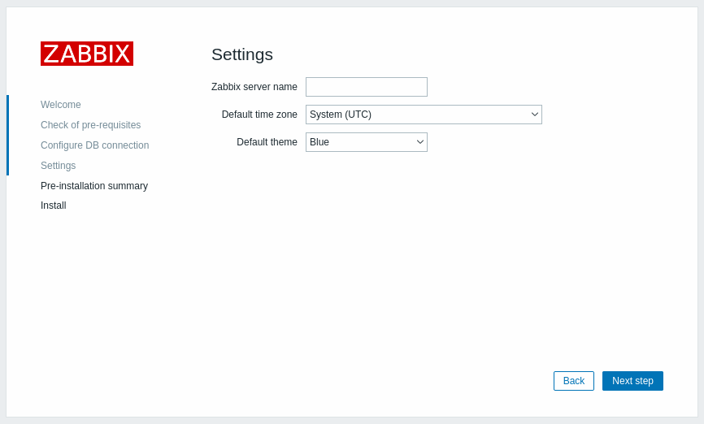
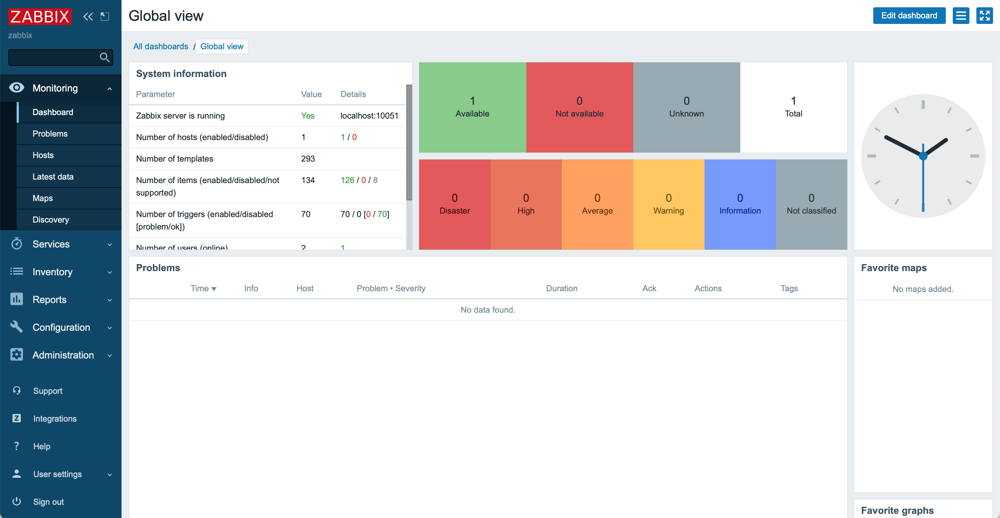

# Curso de Zabbix
## Instalar en Ubuntu 20.04 Focal, Apache Y MySQL

Comprobar que la instalación este actualizada

```
$ sudo su
# apt update
# apt upgrade
```

Instalar herramientas necesarias para test y configuracion

```
# apt install neovim neofetch neomutt nmap
```

### Instalar servidor Apache

Instalar y comprobacion estado del servidor

```
# apt install apache2
# systemctl status apache2
● apache2.service - The Apache HTTP Server
     Loaded: loaded (/lib/systemd/system/apache2.service; enabled; vendor prese>
     Active: active (running) since Mon 2022-04-04 14:44:37 UTC; 31min ago
       Docs: https://httpd.apache.org/docs/2.4/
   Main PID: 20764 (apache2)
      Tasks: 11 (limit: 2274)
     Memory: 73.2M
     CGroup: /system.slice/apache2.service
             ├─20764 /usr/sbin/apache2 -k start
             ├─20765 /usr/sbin/apache2 -k start
             ├─20766 /usr/sbin/apache2 -k start
             ├─20767 /usr/sbin/apache2 -k start
             ├─21097 /usr/sbin/apache2 -k start
             ├─21098 /usr/sbin/apache2 -k start
             ├─21099 /usr/sbin/apache2 -k start
             ├─21100 /usr/sbin/apache2 -k start
             ├─21101 /usr/sbin/apache2 -k start
             ├─21118 /usr/sbin/apache2 -k start
             └─21171 /usr/sbin/apache2 -k start

Apr 04 14:44:37 zabbix systemd[1]: apache2.service: Succeeded.
Apr 04 14:44:37 zabbix systemd[1]: Stopped The Apache HTTP Server.
Apr 04 14:44:37 zabbix systemd[1]: Starting The Apache HTTP Server...
```

Obtener la IP privada y eventualmente la publica

```
# hostname -I
# curl -4 icanhazip.com
```


Comprobar en el navegador si aparece la siguiente portada


### Instalar servidor de MySQL

Instalar y comprobar el estado y version

```
# apt update
# apt install mysql-server
# systemctl status mysql.service
● mysql.service - MySQL Community Server
     Loaded: loaded (/lib/systemd/system/mysql.service; enabled; vendor preset:>
     Active: active (running) since Mon 2022-04-04 14:12:45 UTC; 1h 26min ago
   Main PID: 7560 (mysqld)
     Status: "Server is operational"
      Tasks: 71 (limit: 2274)
     Memory: 666.6M
     CGroup: /system.slice/mysql.service
             └─7560 /usr/sbin/mysqld

Apr 04 14:12:44 zabbix systemd[1]: Starting MySQL Community Server...
Apr 04 14:12:45 zabbix systemd[1]: Started MySQL Community Server.

# mysqladmin -p -u root version
Enter password:
mysqladmin  Ver 8.0.28-0ubuntu0.20.04.3 for Linux on x86_64 ((Ubuntu))
Copyright (c) 2000, 2022, Oracle and/or its affiliates.

Oracle is a registered trademark of Oracle Corporation and/or its
affiliates. Other names may be trademarks of their respective
owners.

Server version		8.0.28-0ubuntu0.20.04.3
Protocol version	10
Connection		Localhost via UNIX socket
UNIX socket		/var/run/mysqld/mysqld.sock
Uptime:			1 hour 27 min 44 sec

Threads: 30  Questions: 172315  Slow queries: 0  Opens: 1788  Flush tables: 3  Open tables: 982  Queries per second avg: 32.734
```

Opcionalmente revisar y cambiar la seguridad

```
# mysql_secure_installation
```

### Instalación Zabbix Server

Instalar Repositorio de Zabbix

```
# wget https://repo.zabbix.com/zabbix/6.0/ubuntu/pool/main/z/zabbix-release/zabbix-release_6.0-1+ubuntu20.04_all.deb
# dpkg -i zabbix-release_6.0-1+ubuntu20.04_all.deb
# apt update
```

Instalar Zabbix Server, Frontend y Agente

```
apt install zabbix-server-mysql zabbix-frontend-php zabbix-apache-conf zabbix-sql-scripts zabbix-agent

```

Crear la base de datos inicial

```
# mysql -u root -p
Enter password:
mysql> create database zabbix character set utf8mb4 collate utf8mb4_bin;
mysql> create user zabbix@localhost identified by 'su clave';
mysql> grant all privileges on zabbix.* to zabbix@localhost;
mysql> quit;
```

Importar el esquema inicial y datos

```
# zcat /usr/share/doc/zabbix-sql-scripts/mysql/server.sql.gz | mysql -u zabbix -p zabbix
Enter password:
```

Configurar la clave de la bade de datos en el archivo de configuracion: **/etc/zabbix/zabbix_server.conf**

```
DBPassword=clave
```

Reiniciar los servicios, comprobar sus estados y habilitarlos

```
# systemctl restart zabbix-server zabbix-agent apache2
# systemctl status zabbix-server
● zabbix-server.service - Zabbix Server
     Loaded: loaded (/lib/systemd/system/zabbix-server.service; enabled; vendor preset: enabled)
     Active: active (running) since Mon 2022-04-04 14:44:37 UTC; 1h 37min ago
   Main PID: 20747 (zabbix_server)
      Tasks: 48 (limit: 2274)
     Memory: 45.9M
     CGroup: /system.slice/zabbix-server.service
             ├─20747 /usr/sbin/zabbix_server -c /etc/zabbix/zabbix_server.conf
             ├─20755 /usr/sbin/zabbix_server: ha manager
             ├─20756 /usr/sbin/zabbix_server: service manager #1 [processed 0 events, updated 0 event tags, deleted 0 problems, synced 0 service update>
             ├─20757 /usr/sbin/zabbix_server: configuration syncer [synced configuration in 0.092675 sec, idle 60 sec]
             ├─20771 /usr/sbin/zabbix_server: alert manager #1 [sent 0, failed 0 alerts, idle 5.007567 sec during 5.007678 sec]
             ├─20772 /usr/sbin/zabbix_server: alerter #1 started
             ├─20773 /usr/sbin/zabbix_server: alerter #2 started
             ├─20774 /usr/sbin/zabbix_server: alerter #3 started
             ├─20775 /usr/sbin/zabbix_server: preprocessing manager #1 [queued 0, processed 13 values, idle 5.014735 sec during 5.014930 sec]

# systemctl status zabbix-agent
● zabbix-agent.service - Zabbix Agent
     Loaded: loaded (/lib/systemd/system/zabbix-agent.service; enabled; vendor preset: enabled)
     Active: active (running) since Mon 2022-04-04 14:44:37 UTC; 1h 40min ago
   Main PID: 20738 (zabbix_agentd)
      Tasks: 6 (limit: 2274)
     Memory: 7.3M
     CGroup: /system.slice/zabbix-agent.service
             ├─20738 /usr/sbin/zabbix_agentd -c /etc/zabbix/zabbix_agentd.conf
             ├─20748 /usr/sbin/zabbix_agentd: collector [idle 1 sec]
             ├─20749 /usr/sbin/zabbix_agentd: listener #1 [waiting for connection]
             ├─20750 /usr/sbin/zabbix_agentd: listener #2 [waiting for connection]
             ├─20751 /usr/sbin/zabbix_agentd: listener #3 [waiting for connection]
             └─20752 /usr/sbin/zabbix_agentd: active checks #1 [idle 1 sec]

Apr 04 14:44:37 zabbix systemd[1]: zabbix-agent.service: Succeeded.
Apr 04 14:44:37 zabbix systemd[1]: Stopped Zabbix Agent.
Apr 04 14:44:37 zabbix systemd[1]: Starting Zabbix Agent...
Apr 04 14:44:37 zabbix systemd[1]: Started Zabbix Agent.

# systemctl status apache2
● apache2.service - The Apache HTTP Server
     Loaded: loaded (/lib/systemd/system/apache2.service; enabled; vendor preset: enabled)
     Active: active (running) since Mon 2022-04-04 14:44:37 UTC; 1h 41min ago
       Docs: https://httpd.apache.org/docs/2.4/
   Main PID: 20764 (apache2)
      Tasks: 11 (limit: 2274)
     Memory: 73.3M
     CGroup: /system.slice/apache2.service
             ├─20764 /usr/sbin/apache2 -k start
             ├─20765 /usr/sbin/apache2 -k start
             ├─20766 /usr/sbin/apache2 -k start
             ├─20767 /usr/sbin/apache2 -k start
             ├─21097 /usr/sbin/apache2 -k start
             ├─21098 /usr/sbin/apache2 -k start
             ├─21099 /usr/sbin/apache2 -k start
             ├─21100 /usr/sbin/apache2 -k start
             ├─21101 /usr/sbin/apache2 -k start
             ├─21118 /usr/sbin/apache2 -k start
             └─21171 /usr/sbin/apache2 -k start

Apr 04 14:44:37 zabbix systemd[1]: apache2.service: Succeeded.
Apr 04 14:44:37 zabbix systemd[1]: Stopped The Apache HTTP Server.
Apr 04 14:44:37 zabbix systemd[1]: Starting The Apache HTTP Server...
Apr 04 14:44:37 zabbix apachectl[20763]: AH00558: apache2: Could not reliably determine the server's fully qualified domain name, using 127.0.1.1. Set >
Apr 04 14:44:37 zabbix systemd[1]: Started The Apache HTTP Server.

# systemctl enable zabbix-server zabbix-agent apache2
```

Para concluir las instalación abrir con el navegador la siguiente url: http://`<su direcion ip>`/zabbix


Elegir el lenguaje por defecto


Compruebe los requisitos


Complete los datos faltantes de la base de datos



Ingrese el nombre del server, el huso horario y seleccione el fondo por defecto


Verifique el sumario


Si esta todo correcto aparece esta pantalla


Pantalla de login, la primera conexion 

Username: **Admin**

Password: **zabbix**



Si esta todo correcto esta pantalla se vera