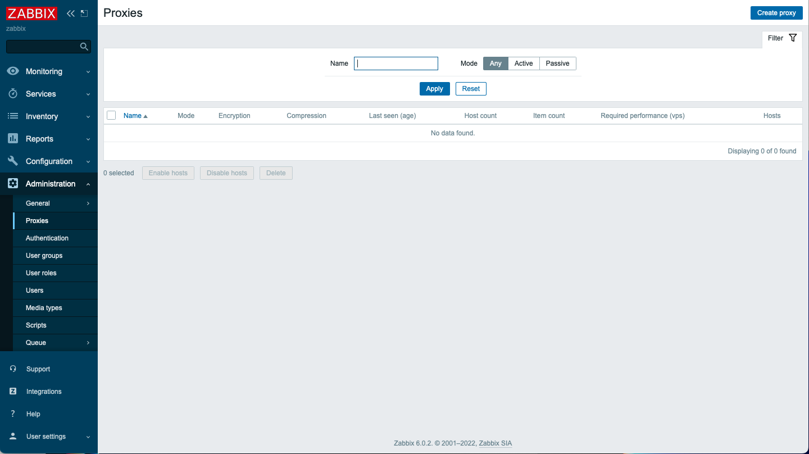
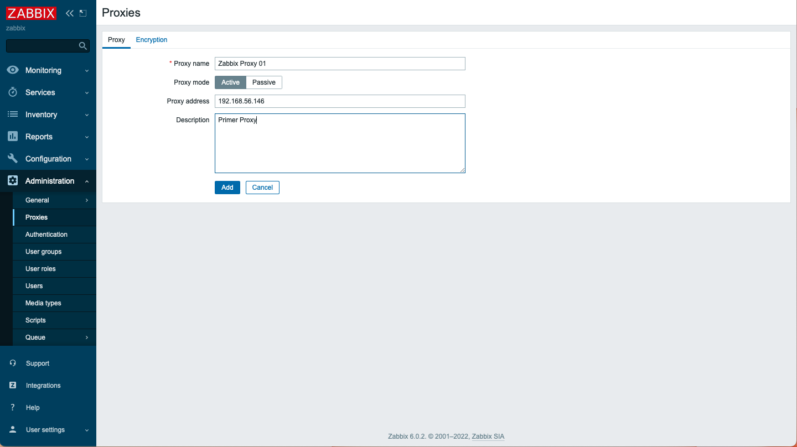
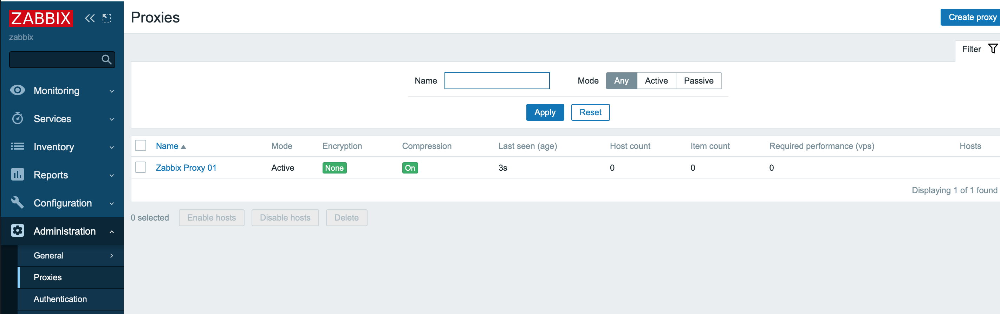
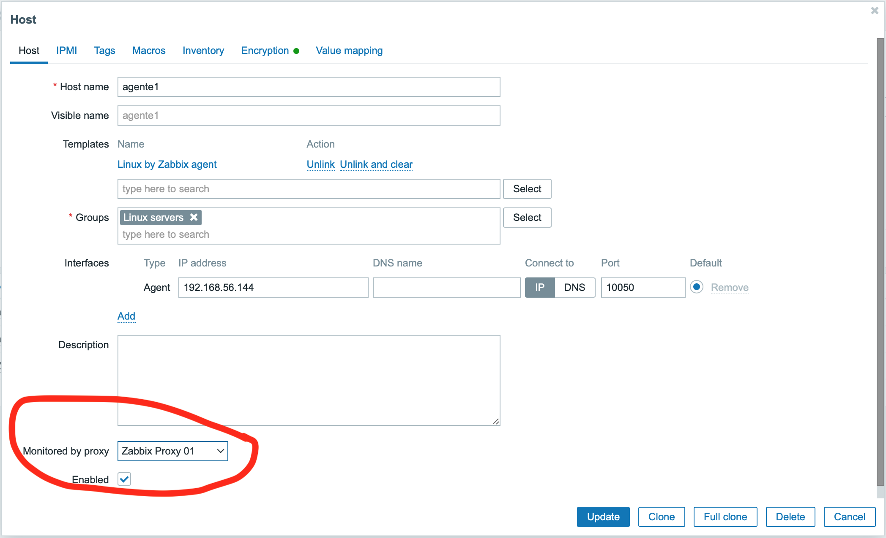
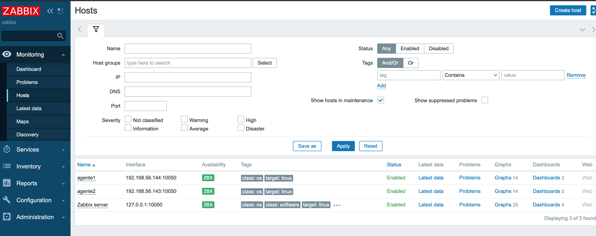
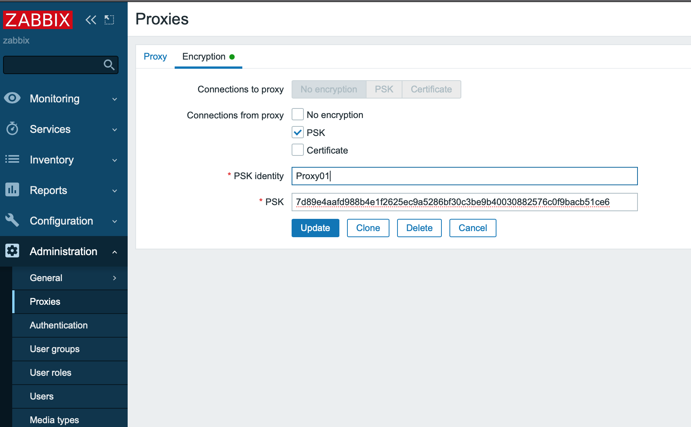
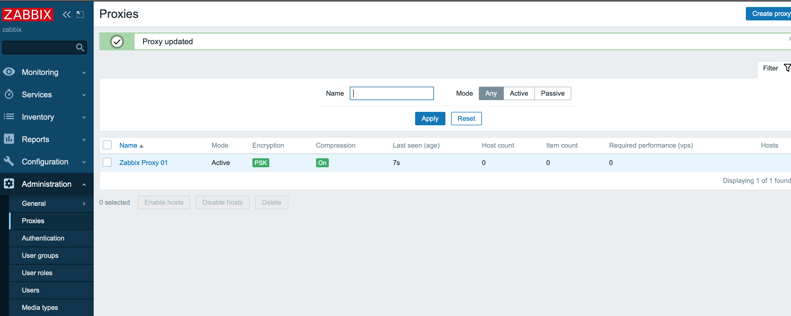

# Curso de Zabbix
## Instalar en Ubuntu 20.04 Focal

Comprobar que la instalación este actualizada e instalar herramientas necesarias

```
$ sudo su
# apt update
# apt upgrade
# apt install neovim net-tools
```

### Instalar servidor de MySQL

```
# apt install mysql-server
# systemctl status mysql.service
● mysql.service - MySQL Community Server
     Loaded: loaded (/lib/systemd/system/mysql.service; enabled; vendor preset: enabled)
     Active: active (running) since Tue 2022-04-05 18:06:22 UTC; 17s ago
   Main PID: 3465 (mysqld)
     Status: "Server is operational"
      Tasks: 38 (limit: 2274)
     Memory: 357.5M
     CGroup: /system.slice/mysql.service
             └─3465 /usr/sbin/mysqld

Apr 05 18:06:20 proxy systemd[1]: Starting MySQL Community Server...
Apr 05 18:06:22 proxy systemd[1]: Started MySQL Community Server.

# mysqladmin -p -u root version
Enter password: 
mysqladmin  Ver 8.0.28-0ubuntu0.20.04.3 for Linux on x86_64 ((Ubuntu))
Copyright (c) 2000, 2022, Oracle and/or its affiliates.

Oracle is a registered trademark of Oracle Corporation and/or its
affiliates. Other names may be trademarks of their respective
owners.

Server version          8.0.28-0ubuntu0.20.04.3
Protocol version        10
Connection              Localhost via UNIX socket
UNIX socket             /var/run/mysqld/mysqld.sock
Uptime:                 1 min 12 sec

Threads: 2  Questions: 2  Slow queries: 0  Opens: 117  Flush tables: 3  Open tables: 36  Queries per second avg: 0.027
```

Opcionalmente revisar y cambiar la seguridad

```
# mysql_secure_installation
```

### Instalación Zabbix Proxy Server

Instalar Repositorio de Zabbix

```
# wget https://repo.zabbix.com/zabbix/6.0/ubuntu/pool/main/z/zabbix-release/zabbix-release_6.0-1+ubuntu20.04_all.deb
# dpkg -i zabbix-release_6.0-1+ubuntu20.04_all.deb
# apt update
# apt upgrade
```

Instalar Zabbix Proxy Server

```
apt install zabbix-proxy-mysql zabbix-sql-scripts zabbix-agent

```

Crear la base de datos inicial

```
# mysql -u root -p
Enter password:
mysql> create database zabbix_proxy character set utf8mb4 collate utf8mb4_bin;
mysql> create user zabbix@localhost identified by 'su clave';
mysql> grant all privileges on zabbix_proxy.* to zabbix@localhost;
mysql> quit;
```

Importar el esquema inicial y datos

```
# cat /usr/share/doc/zabbix-sql-scripts/mysql/proxy.sql | mysql -u zabbix -p zabbix_proxy
Enter password:
```

Configurar la clave de la base de datos en el archivo de configuracion: **/etc/zabbix/zabbix_proxy.conf**

```
ProxyMode=0
DBPassword=clave
ConfigFrequency=100
Server=192.168.56.145  # Direccion del Zabbix Server
Hostname=Zabbix Proxy 01
DBName=zabbix_proxy
DBUser=zabbix
```

Reiniciar el servicio, comprobar su estado y habilitarlo

```
# systemctl restart zabbix-proxy
# systemctl status zabbix-proxy
● zabbix-proxy.service - Zabbix Proxy
     Loaded: loaded (/lib/systemd/system/zabbix-proxy.service; disabled; vendor preset: enabled)
     Active: active (running) since Tue 2022-04-05 18:38:59 UTC; 16s ago
    Process: 7547 ExecStart=/usr/sbin/zabbix_proxy -c $CONFFILE (code=exited, status=0/SUCCESS)
   Main PID: 7560 (zabbix_proxy)
      Tasks: 1 (limit: 2274)
     Memory: 4.0M
     CGroup: /system.slice/zabbix-proxy.service
             └─7560 /usr/sbin/zabbix_proxy -c /etc/zabbix/zabbix_proxy.conf

Apr 05 18:38:59 proxy systemd[1]: Starting Zabbix Proxy...
Apr 05 18:38:59 proxy systemd[1]: zabbix-proxy.service: Can't open PID file /run/zabbix/zabbix_proxy.pid (yet?) after start: Operation not permitted
Apr 05 18:38:59 proxy systemd[1]: Started Zabbix Proxy.

# systemctl enable zabbix-proxy
```



Ir a la opcion de <span style="color:#2471A3">Administration/Proxies/Create proxy</span>



Ingresar el <span style="color:#2471A3">Proxy name</span>

Ingresar el <span style="color:#2471A3">Proxy address</span>



Compruebe que se realizo la conexion 

Para cambiar la conexion de un agente edite el archivo de configuración **/etc/zabbix/zabbix_agentd.conf** y modifique el **Server** y el **ServerActive**

```
PidFile=/run/zabbix/zabbix_agentd.pid
LogFile=/var/log/zabbix/zabbix_agentd.log
LogFileSize=3
Server=192.168.56.147,127.0.0.1
ServerActive=192.168.56.147
Hostname=agente1
Include=/etc/zabbix/zabbix_agentd.d/*.conf
TLSConnect=psk
TLSAccept=psk
TLSPSKIdentity=PSK 001
TLSPSKFile=/etc/zabbix/zabbix_agentd.psk

```

Reiniciar los servicios, comprobar sus estados

```
# systemctl restart zabbix-agent 
# systemctl status zabbix-agent
● zabbix-agent.service - Zabbix Agent
     Loaded: loaded (/lib/systemd/system/zabbix-agent.service; disabled; vendor preset: enabled)
     Active: active (running) since Tue 2022-04-05 14:43:02 UTC; 16min ago
   Main PID: 646 (zabbix_agentd)
      Tasks: 6 (limit: 1066)
     Memory: 11.2M
     CGroup: /system.slice/zabbix-agent.service
             ├─646 /usr/sbin/zabbix_agentd -c /etc/zabbix/zabbix_agentd.conf
             ├─651 /usr/sbin/zabbix_agentd: collector [idle 1 sec]
             ├─652 /usr/sbin/zabbix_agentd: listener #1 [waiting for connection]
             ├─653 /usr/sbin/zabbix_agentd: listener #2 [waiting for connection]
             ├─654 /usr/sbin/zabbix_agentd: listener #3 [waiting for connection]
             └─655 /usr/sbin/zabbix_agentd: active checks #1 [idle 1 sec]

Apr 05 14:43:02 manual systemd[1]: Starting Zabbix Agent...
Apr 05 14:43:02 manual systemd[1]: Started Zabbix Agent.

```



Configurar el Host para que dependa del Proxy configurado



Comprobar que se conecte


### Configuración avanzada del Zabbix Proxy con Encriptación ###

```
# openssl rand -hex 32 > /etc/zabbix/zabbix_proxy.psk
# cat /etc/zabbix/zabbix_proxy.psk
7d89e4aafd988b4e1f2625ec9a5286bf30c3be9b40030882576c0f9bacb51ce6
```

Edito el archivo de configuración

```
# nvim /etc/zabbix/zabbix_proxy.conf
```

Agrego las siguientes lineas:

```
TLSConnect=psk             
TLSAccept=psk             
TLSPSKIdentity=Proxy01
TLSPSKFile=/etc/zabbix/zabbix_proxy.psk
```



En la configuración del proxy agrego la clave precargada en el server


```
# systemctl restart zabbix-proxy
# systemctl status zabbix-proxy
● zabbix-proxy.service - Zabbix Proxy
     Loaded: loaded (/lib/systemd/system/zabbix-proxy.service; enabled; vendor preset: enabled)
     Active: active (running) since Tue 2022-04-05 22:46:20 UTC; 5min ago
    Process: 8489 ExecStart=/usr/sbin/zabbix_proxy -c $CONFFILE (code=exited, status=0/SUCCESS)
   Main PID: 8507 (zabbix_proxy)
      Tasks: 32 (limit: 2274)
     Memory: 21.1M
     CGroup: /system.slice/zabbix-proxy.service
             ├─8507 /usr/sbin/zabbix_proxy -c /etc/zabbix/zabbix_proxy.conf
             ├─8509 /usr/sbin/zabbix_proxy: configuration syncer [synced config 3687 bytes in 0.015782 sec, idle 100 sec]
             ├─8510 /usr/sbin/zabbix_proxy: trapper #1 [processed data in 0.000000 sec, waiting for connection]
             ├─8511 /usr/sbin/zabbix_proxy: trapper #2 [processed data in 0.000000 sec, waiting for connection]
             ├─8512 /usr/sbin/zabbix_proxy: trapper #3 [processed data in 0.000000 sec, waiting for connection]
             ├─8513 /usr/sbin/zabbix_proxy: trapper #4 [processed data in 0.000000 sec, waiting for connection]
             ├─8514 /usr/sbin/zabbix_proxy: trapper #5 [processed data in 0.000000 sec, waiting for connection]
             ├─8515 /usr/sbin/zabbix_proxy: preprocessing manager #1 [queued 0, processed 0 values, idle 5.009135 sec during 5.009320 sec]
             ├─8516 /usr/sbin/zabbix_proxy: preprocessing worker #1 started
             ├─8517 /usr/sbin/zabbix_proxy: preprocessing worker #2 started
             ├─8518 /usr/sbin/zabbix_proxy: preprocessing worker #3 started
             ├─8519 /usr/sbin/zabbix_proxy: heartbeat sender [sending heartbeat message success in 0.003354 sec, idle 60 sec]
             ├─8520 /usr/sbin/zabbix_proxy: data sender [sent 0 values in 0.006154 sec, idle 1 sec]
             ├─8521 /usr/sbin/zabbix_proxy: housekeeper [startup idle for 30 minutes]
             ├─8522 /usr/sbin/zabbix_proxy: http poller #1 [got 0 values in 0.000785 sec, idle 5 sec]
             ├─8523 /usr/sbin/zabbix_proxy: discoverer #1 [processed 0 rules in 0.000572 sec, idle 60 sec]

# tail -f /var/log/zabbix/zabbix_proxy.log
  8531:20220405:224620.369 proxy #20 started [self-monitoring #1]
  8535:20220405:224620.369 proxy #24 started [poller #3]
  8536:20220405:224620.371 proxy #25 started [poller #4]
  8537:20220405:224620.371 proxy #26 started [poller #5]
  8538:20220405:224620.372 proxy #27 started [unreachable poller #1]
  8539:20220405:224620.372 proxy #28 started [icmp pinger #1]
  8540:20220405:224620.374 proxy #29 started [history poller #1]
  8541:20220405:224620.374 proxy #30 started [availability manager #1]
  8542:20220405:224620.375 proxy #31 started [odbc poller #1]
  8520:20220405:224652.436 Connection restored.
```



Verificar que el proxy tambien se comunique con la encriptacion elegida